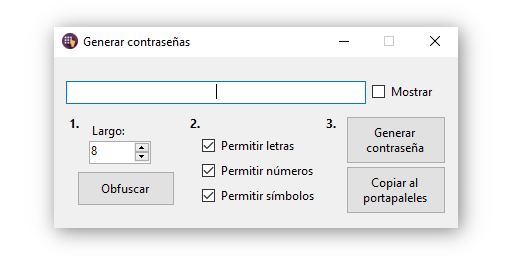

# Password magician

This is a password "generator", but it does more that generate passwords, it can:

1. Generate passwords.
2. Obfuscate passwords.
3. Encrypt passwords.

See the [changelog](CHANGELOG.md) for further information about the software.

  

## License

This repository is available under the [MIT License](LICENSE).

> Live long, and prosper.  
> Spock
